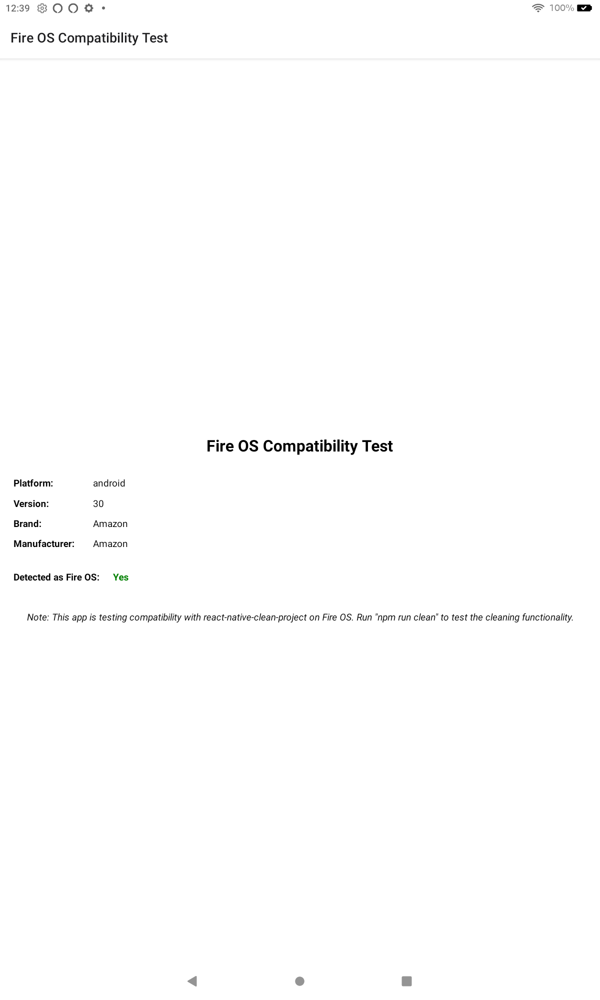

# Fire OS Compatibility Test

A React Native application that tests compatibility with Fire OS devices and the react-native-clean-project package.



## Features

- **Fire OS Detection**: Automatically detects if the app is running on a Fire OS device
- **Device Information Display**: Shows platform details including OS, version, brand, and manufacturer
- **Clean Project Integration**: Tests compatibility with react-native-clean-project on Fire OS
- **Platform Constants**: Demonstrates how to access platform-specific information on Fire OS

## Why This Matters

Fire OS is based on Android but has some differences that can affect React Native app development. This app helps developers:

1. Properly detect Fire OS devices in their React Native applications
2. Test build tools compatibility with Fire OS
3. Understand what platform information is available on Fire OS devices
4. Ensure development workflows work correctly on Amazon's platform

## Setup Instructions

### Prerequisites
- Node.js and npm installed
- Expo CLI installed (`npm install -g expo-cli`)
- A Fire OS device (Fire tablet or Fire TV) or emulator
- Developer options enabled on your Fire OS device

### Installation

1. Clone this repository:
   ```
   git clone https://github.com/mosesroth/fire-os-compat-test.git
   cd fire-os-compat-test
   ```

2. Install dependencies:
   ```
   npm install
   ```

3. Start the app:
   ```
   npx expo start
   ```

### Building for Fire OS

1. Build the app for Android:
   ```
   npx expo prebuild --platform android
   cd android
   ./gradlew assembleDebug
   ```

2. The APK will be generated at `android/app/build/outputs/apk/debug/app-debug.apk`

3. Install the APK on your Fire OS device

## Testing react-native-clean-project

This app includes react-native-clean-project as a dev dependency to test its compatibility with Fire OS development. To test the cleaning functionality:

```
npm run clean
```

This will run the clean project command which should work correctly on Fire OS development projects.

## Fire OS Detection Logic

The app uses the following logic to detect Fire OS devices:

```javascript
const isFireOS = Platform.OS === 'android' && 
                (Platform.constants?.Brand?.toLowerCase()?.includes('amazon') || 
                 Platform.constants?.Manufacturer?.toLowerCase()?.includes('amazon'));
```

This detection method checks if:
1. The platform is Android (Fire OS is based on Android)
2. The device brand or manufacturer contains "amazon"

## Technologies Used

- React Native
- Expo
- react-native-clean-project
